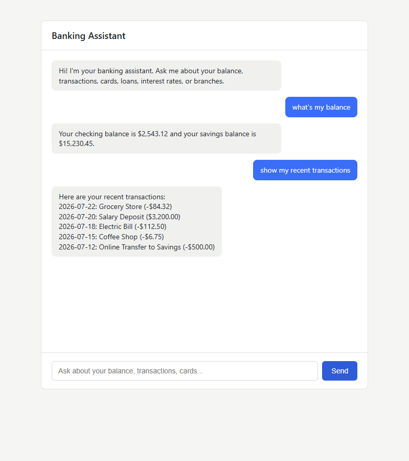
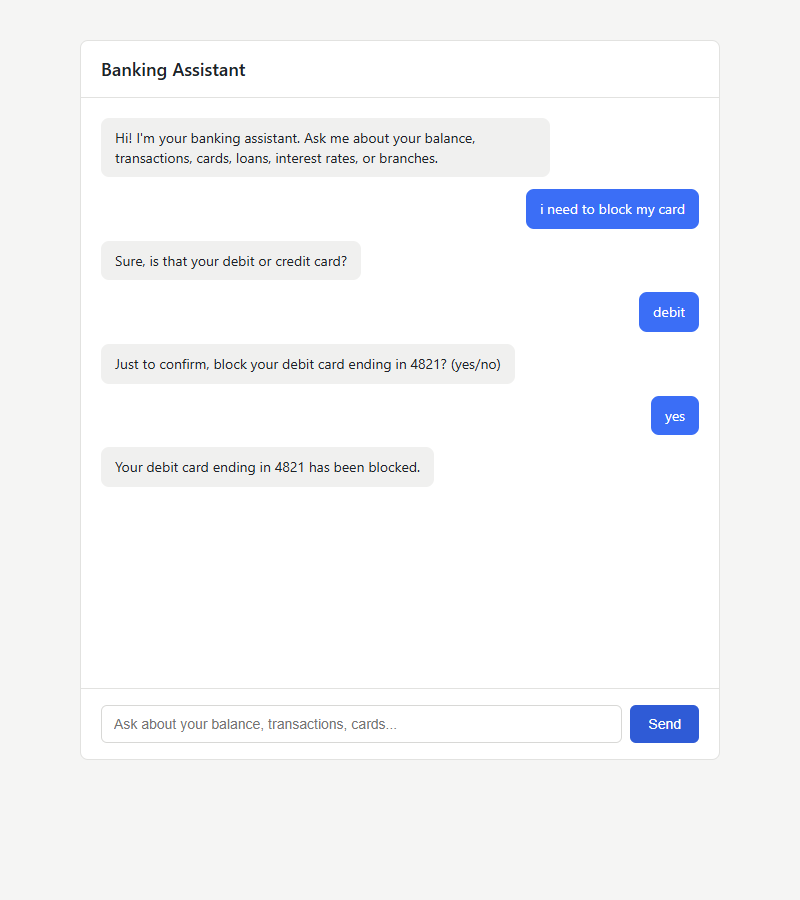

# Banking Chatbot

A small AI-powered banking chatbot with intent recognition and simple dialog
management, served through a minimal web chat UI. It answers common banking
queries (balance, transactions, loans, interest rates, branches, complaints)
and handles a short multi-turn flow for blocking a card, all against mock
data — there is no real banking integration.

## Screenshots

Single-turn lookups (balance, transactions):



Multi-turn card-block flow (ask card type → confirm → block):



## How it works

- **Intent recognition**: a scikit-learn pipeline (`TfidfVectorizer` +
  `LogisticRegression`) trained on ~180 hand-written example phrases across
  10 intents (`data/training_data.json`). If the model's confidence for a
  message is below a threshold, the bot returns a fallback/clarification
  reply instead of guessing.
- **Dialog management**: intentionally lightweight. Every intent except
  `card_block` is answered in a single turn by looking up mock data. Blocking
  a card is the one flow that spans turns: the bot asks which card (if not
  already stated), then asks for a yes/no confirmation before "blocking" it.
  Session state is just a small in-memory dict per browser session.
- **Mock data** (`data/mock_data.json`): one demo customer with a checking
  and savings balance, a handful of transactions, two cards, loan product
  blurbs, interest rates, and branch addresses.

## Project structure

```
data/               training data + mock bank data
models/             trained classifier (generated by chatbot/train.py)
chatbot/            intent classifier, response/dialog logic
backend/            Flask app (serves the API and the frontend)
frontend/           static chat widget (HTML/CSS/JS, no build step)
tests/              pytest sanity checks
```

## Setup

```bash
python -m venv venv
source venv/Scripts/activate   # Windows: venv\Scripts\activate
pip install -r requirements.txt
python chatbot/train.py        # trains and saves the intent classifier
python backend/app.py
```

Then open http://localhost:5000 in a browser.

By default the server binds to `127.0.0.1` with debug mode off. To change
host/port or enable Flask's debugger for local development, set env vars
before running:

```bash
HOST=0.0.0.0 PORT=8080 FLASK_DEBUG=true python backend/app.py
```

Never set `FLASK_DEBUG=true` on a server reachable by anyone but you — the
Flask/Werkzeug debugger allows arbitrary code execution.

## Supported intents

`greeting`, `goodbye`, `thanks`, `balance_inquiry`, `transaction_history`,
`card_block`, `loan_info`, `interest_rates`, `branch_locator`, `complaint`.

Example things to try:
- "what's my balance"
- "show my last transactions"
- "block my debit card" (then answer the follow-up questions)
- "tell me about home loans"
- "what's the current savings interest rate"
- "find a branch near me"

## Running tests

```bash
python -m pytest tests/
```

`chatbot/train.py` also prints a holdout accuracy and classification report
each time it's run — that's the one quantitative metric in this project, and
it's based on the synthetic training data, not real customer queries.

## Security notes

This is a portfolio/demo project, but the `/chat` endpoint applies some
basic hardening:

- Debug mode is off by default (`FLASK_DEBUG` env var must be explicitly
  set to enable it) — the Werkzeug debugger is not exposed.
- Request bodies are capped at 8 KB, chat messages are capped at 500
  characters, and only well-formed JSON objects are accepted; malformed or
  wrong-typed input gets a `400` instead of a stack trace.
- A simple in-memory per-IP rate limit (30 requests / 10s) returns `429` on
  bursts.
- The in-memory session store is capped at 5,000 sessions with FIFO
  eviction, so it can't be grown unboundedly by spamming fake session ids.
- Responses set `X-Content-Type-Options`, `X-Frame-Options`, a same-origin
  `Content-Security-Policy`, and `Referrer-Policy` headers.
- The frontend renders bot/user messages via `textContent` (not
  `innerHTML`), so chat content can't inject HTML/script into the page.
- No secrets, credentials, or real customer data exist anywhere in this
  repo — everything is synthetic/mock.

Things intentionally out of scope for a local demo (call these out if you
ever deploy this beyond your own machine): this runs on Flask's built-in
dev server, not a production WSGI server (e.g. gunicorn/waitress) behind
HTTPS; there's no authentication; and the session store is process-local
in-memory, not persisted or shared across instances.

## Limitations

- All data is mock/simulated; there's no real banking or auth integration.
- One hardcoded demo customer, shared across all chat sessions.
- Sessions are stored in memory and reset when the server restarts.
- Training data is synthetic (hand-written), not real user queries.
